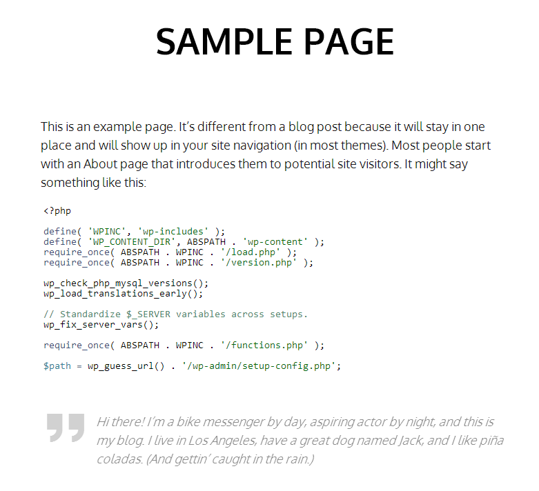
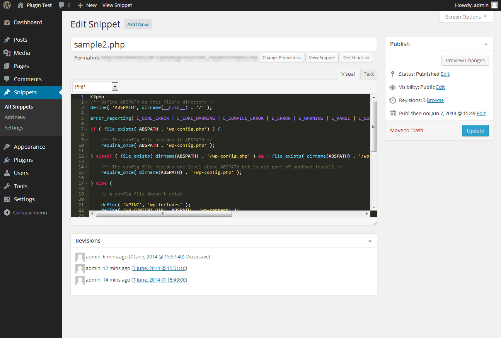
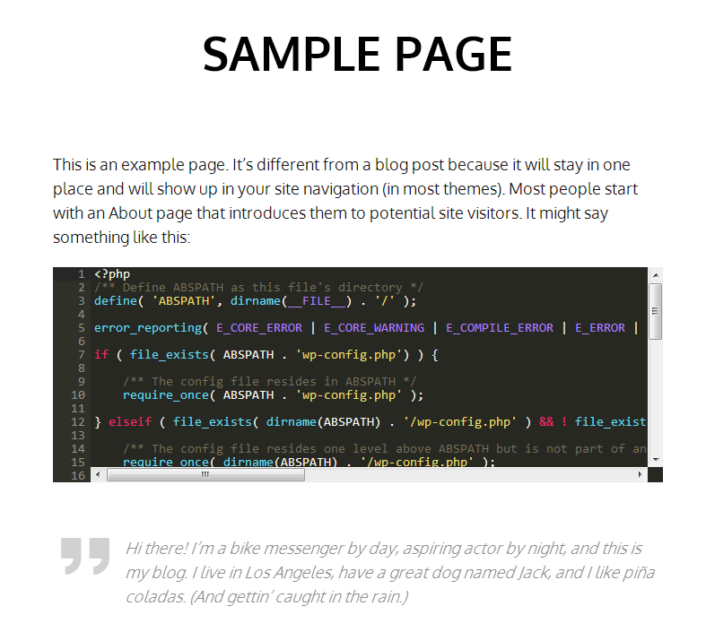

### NOTICE: No longer maintained.

# Snippets Done Right

A WordPress plugin, that allows you to create snippets in over 100 programming languages and choose between 32 highlighter themes.

The front-end and back-end are powered by ACE Editor. 

You can write your code snippets directly in the WordPress admin area, as you would in any other code editor.

All snippets are available for embedding into posts, pages and custom post types via an `Embed Snippet` button in the standard WordPress content editor. Snippets are embedded as shortcodes.

Usage instructions: [http://siyanpanayotov.com/project/snippets-done-right/](http://siyanpanayotov.com/project/snippets-done-right/)

## Done Right means...
Seamless integration into your WordPress. No ads. No donate buttons. No backdoors.

## Installation

1. Upload `snippets-done-right` to the `/wp-content/plugins/` directory
1. Activate the plugin through the 'Plugins' menu in WordPress
1. Use the Embed Snippet button to embed snippets into posts, pages and custom post types

Usage instructions: [http://siyanpanayotov.com/project/snippets-done-right/](http://siyanpanayotov.com/project/snippets-done-right/)

## Screenshots

<table>
    <tr>
        <td>
            
        </td>
        <td>
            
        </td>
        <td>
            
        </td>
    </tr>
</table>

1. Simple and clean integration with your theme
2. Back-end editor powered by ACE Editor
3. Multiple highlight themes to choose from

## Changelog

* **v1.0**
  Initial release.